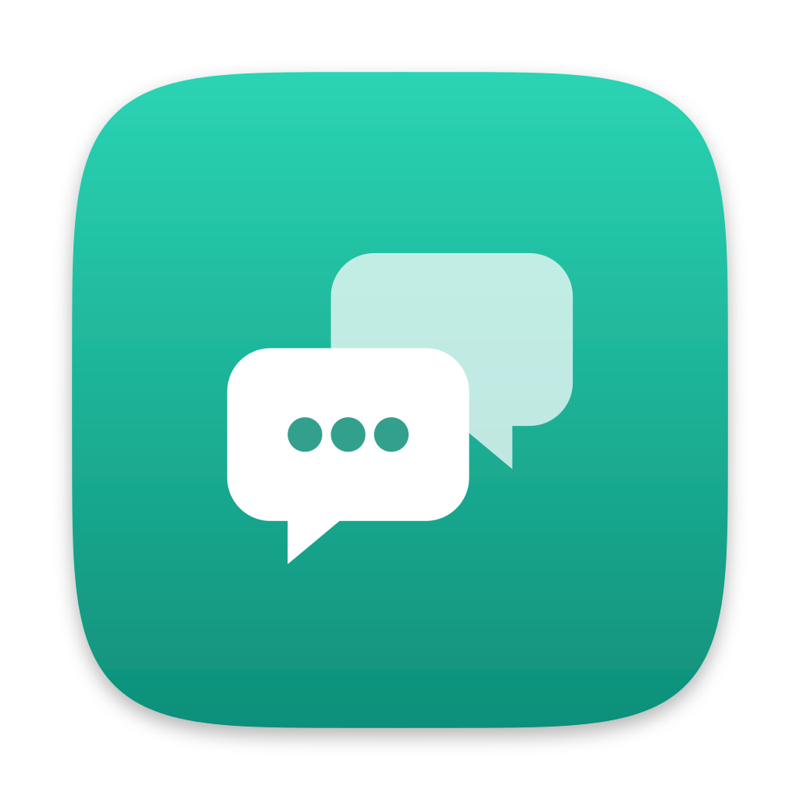

# crosstalk

Lets the apps on your Macs talk to each other: ask an app on another
Mac to refresh, share each Mac's status, keep a setting the same
everywhere. Small JSON, for orchestration, not files or streams.

Everything goes by a name the apps agree on, and there are three things
to do with one:

```sh
# Messages: ask something on another Mac, live
crosstalk listen tagteam --run ./handle.sh        # on lychee
crosstalk send lychee tagteam '{"do":"refresh"}'  # on any other Mac

# Posted values: one per Mac, readable by the others at any time
crosstalk post lookout:disk-report '{"free":12}'  # on lychee
crosstalk read lychee lookout:disk-report         # on any other Mac

# Synced values: one for all Macs, the latest write wins
crosstalk set tagteam:theme '"dark"'
crosstalk get tagteam:theme
```

If something has to be there to act on it now, it is a message. If it
should still be there later, it is a value.

Two parts:

- **`worker/`**: the hub, a Cloudflare Worker you deploy on your own
  account. Each Mac keeps one connection to it, and it passes messages
  between them.
- **the `crosstalk` binary**: the daemon that runs on each Mac, and the
  command that talks to it.

## One-time hub setup

Requires a Cloudflare account with a domain on it. The free tier is plenty.

```sh
crosstalk key                         # prints a key and a hub token
cd worker
bunx wrangler login
bunx wrangler deploy --domain crosstalk.<your domain>
bunx wrangler secret put HUB_TOKEN    # paste the hub token
```

Keep the key somewhere safe. It is the only secret: any Mac that has it is
one of your devices.

## Install

```sh
curl -fsSL https://raw.githubusercontent.com/dittofleet/.github/main/install.sh | sh -s crosstalk
```

Installs the latest release to `~/.local/bin/crosstalk` (override with
`CROSSTALK_INSTALL_DIR`), asks for the hub's address and the key, and
starts the daemon as a launchd agent that runs at login (log in
`~/Library/Logs/crosstalk.log`). The Mac joins under its own name
(`Lychee.local` becomes `lychee`).

`crosstalk join <hub url>` joins again, with `--name` for another name.
`CROSSTALK_HUB` and `CROSSTALK_KEY` set on the `sh` side of the pipe skip
the questions.

## Usage

```sh
crosstalk send <device> <name> [<json> | -]   # send, print the reply
crosstalk send --all <name> [<json> | -]      # to every other connected Mac, no replies
crosstalk listen <name> [--run <command>...]  # receive messages

crosstalk post [--expires 36h] <name> <json | ->
crosstalk unpost <name>
crosstalk read [--fresh] <device> <name>
crosstalk read --all <name>

crosstalk set <name> <json | ->
crosstalk unset <name>
crosstalk get <name>

crosstalk watch <name>                        # the values, then a line per change
crosstalk devices                             # your Macs, and which are connected
```

A name is any string. `app:channel` keeps them tidy, but it is only a
convention: `lookout` and `lookout:disk-report` are unrelated.

**Messages.** A send waits for the reply (10 seconds, or `--timeout`) and
fails clearly when the Mac is not connected, nothing there is listening, or
nothing answered. Nothing is queued, so a message for a Mac that is asleep
fails rather than arriving when it wakes. `listen --run` runs the command
once per message with the body on stdin, and what it prints is the reply.
Plain `listen` prints each message as a line of JSON and takes replies as
lines on stdin, `{"id": <its id>, "body": <any JSON>}`.

Lines with a `crosstalk` key are notices from the daemon, not messages.
`{"crosstalk":{"hub":"connected"}}` comes when messages can reach the
listener again after a time when they could not: when it starts listening,
when the daemon has restarted, and each time the daemon connects to the hub
again, for example after the Mac wakes or changes network. Messages sent in
between never arrive, so this is the moment for an app to catch up. `--run`
does not run the command for a notice.

**Posted values** are kept by the daemon, so they outlast the app that
posted them, and each Mac keeps the last one it saw from the others, so
`read` works while the poster is asleep. `--expires` drops a value that is
not posted again in time. `read --fresh` first asks whatever listens on the
same name on that Mac to post again.

**Synced values** are kept on every Mac, and a change reaches the others
when they next connect. Nothing is merged: if two Macs change one while
apart, the later change wins. Give each setting its own name.

Apps can also skip the command and speak lines of JSON to the daemon's
socket at `~/.local/share/crosstalk/sock`: the first line is the command as
an op, such as `{"op":"listen","name":"tagteam"}`. `listen` and `watch`
carry on when the daemon restarts, as it does for an update, but an app on
the socket has to connect again itself.

Messages and values are limited to 256 KB.

## What the hub can and cannot see

Only Macs with the key can connect. Messages are encrypted between Macs
with a key the hub never has, so it cannot read, alter, redirect or replay
them. The hub and Cloudflare can see which Macs are connected, when they
talk and how much.

Any app or script running as you can use the daemon. A lost Mac cannot be shut
out on its own: make a new key, set its hub token, and join again on the
Macs you still have.

## Updating and uninstalling

`crosstalk update` installs the latest release and restarts the daemon. Once
a day, crosstalk prints a hint when one is out. It skips the check when `CI`
or `CROSSTALK_NO_UPDATE_CHECK` is set or stderr is not a terminal.

`crosstalk uninstall` stops the daemon and removes the binary, config and
values, after asking (`--yes` skips the prompt). The hub is untouched.

## Development

Tests: `go test ./...` for the daemon, `cd worker && bun test` for the hub.
`bunx wrangler dev --var "HUB_TOKEN:$(crosstalk key token)"` in `worker/`
runs a hub locally, and `crosstalk join --no-service http://localhost:8787`
joins it without starting the background service.
